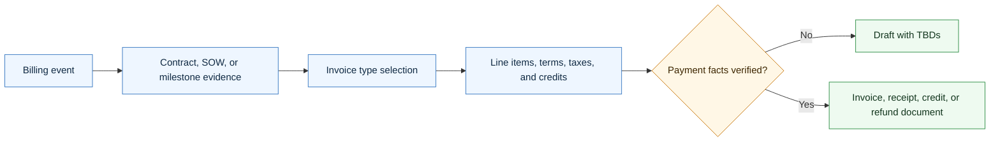
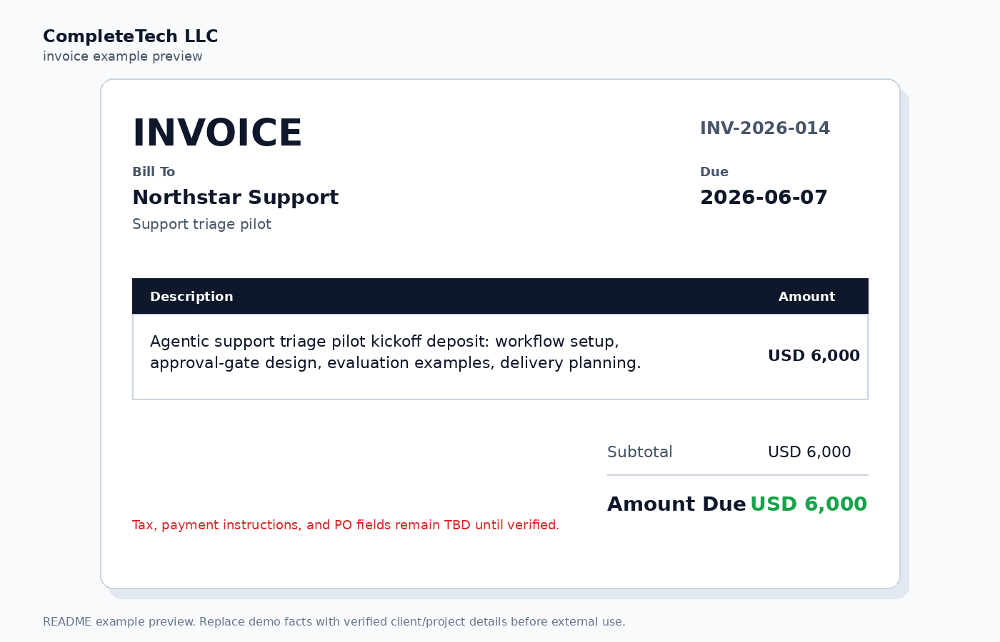

# Agentic Invoice Skill

<p align="center">
  
</p>

A CompleteTech LLC Codex skill for creating invoice drafts and billing documents for agentic development engagements.

## About

Part of the CompleteTech LLC agentic services skill library. This skill drafts billing documents tied to verified contracts, scopes, milestones, payment terms, credits, refunds, and support events.

## OpenClaw / ClawHub Metadata

- Skill key: `agentic-invoice-skill`
- Version-ready metadata: `1.0.0`
- Homepage: https://github.com/CompleteTech-LLC/agentic-invoice-skill
- README: https://github.com/CompleteTech-LLC/agentic-invoice-skill#readme
- Runtime binaries: `python3`
- Python packages: `reportlab>=4.0` (optional PNG preview: `pypdfium2`, `pillow`)
- Intended registry/discovery tags: `latest`, `complete-tech`, `codex-skill`, `agentic-development`, `agentic-workflows`, `invoice`, `billing`, `payments`, `pdf`, `pdf-generator`
- License: repository code, templates, and documentation use MIT; ClawHub publishing is intentionally skipped for now.
- Brand assets: CompleteTech LLC names, logos, seals, and brand assets are reserved; see `BRAND_ASSETS.md`.

## Workflow Diagram

Source: [assets/diagrams/workflow.mmd](assets/diagrams/workflow.mmd).




## What It Does

- Selects the right invoice by billing event.
- Drafts invoices, pro formas, deposits, milestone invoices, change-order invoices, retainers, pass-through invoices, credit memos, refund memos, receipts, and closeout billing.
- Keeps line items aligned with practical agentic development work: workflow discovery, pilot implementation, evaluation, approval gates, monitoring, documentation, handoff, support, and expansion.
- Includes a near-exhaustive invoice catalog for the full billing lifecycle.

## Contents

- `SKILL.md` - operating instructions and invoice-selection guide.
- `references/invoice-catalog.md` - 36 reusable invoice and billing-document templates.
- `references/use-case-decision-table.md` - quick guide for choosing the right invoice.
- `references/invoice-lifecycle.md` - end-to-end billing workflow and approval gates.
- `references/invoice-positioning.md` - CompleteTech LLC invoice language and guardrails.
- `scripts/render_invoice.py` - deterministic template listing and rendering helper.
- `scripts/render_pdf.py` - branded CompleteTech PDF generator (Markdown -> PDF + optional PNG preview).
- `requirements.txt` - Python dependencies for branded PDF rendering.

## Quick Start

```bash
python3 scripts/render_invoice.py --list
python3 scripts/render_invoice.py \
  --template pilot-deposit-invoice \
  --var invoice_number=INV-1001 \
  --var issue_date=2026-05-24 \
  --var due_date=2026-06-08 \
  --var contract_id=ADSA-DEMO-0001 \
  --var workflow="support triage" \
  --var amount_due="USD 6,000"
```

Rendered templates are drafts. Replace placeholders with verified client, contract, tax, payment, and accounting details before use.

## Example



Example files: [Markdown](assets/examples/example.md) · [PDF](assets/examples/example.pdf) · [DOCX](assets/examples/example.docx).

**Milestone invoice: Northwind Trading Co. — prototype milestone**

- Bills the accepted prototype milestone under ADSA-2026-0142 with a deposit credit applied.
- Line items, subtotal, and total due (USD 9,520.00) on a branded one-page invoice.
- Net 15 terms; rendered with `--no-cover` for a proper single-document invoice.
- Demonstration artifact — never invents bank, tax ID, or PO numbers.

Generate it in one command (branded PDF + Markdown, like the contract skill):

```bash
pip install -r requirements.txt
python3 scripts/render_invoice.py --template milestone-invoice \
  --out assets/examples/example.pdf --png assets/examples/example.png \
  --markdown-out assets/examples/example.md \
  --logo assets/logo.png --no-cover --title "Invoice INV-2026-0461" --doc-type "MILESTONE INVOICE" \
  --meta "INVOICE NO.=INV-2026-0461" --meta "DUE=2026-06-23"
```

The committed `example.{md,pdf,png}` use curated, realistic demonstration data for the Northwind Trading Co. support-triage pilot; pass `--var key=value` to fill template placeholders with your own facts.

## Brand Notes

Use clear, specific, auditable line items. Separate professional services, pass-through costs, expenses, taxes, credits, and late fees. Do not invent tax IDs, banking details, tax rates, purchase orders, contract terms, or legal/accounting conclusions.

## License

Code, templates, and documentation are licensed under the MIT License. CompleteTech LLC names, logos, seals, and brand assets are reserved and are not licensed for reuse except to identify this project. See `LICENSE` and `BRAND_ASSETS.md`.
